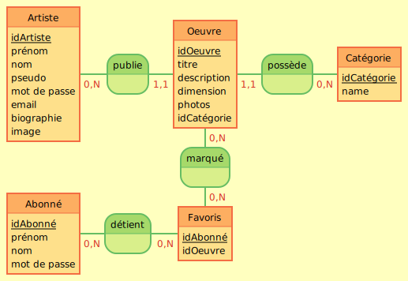
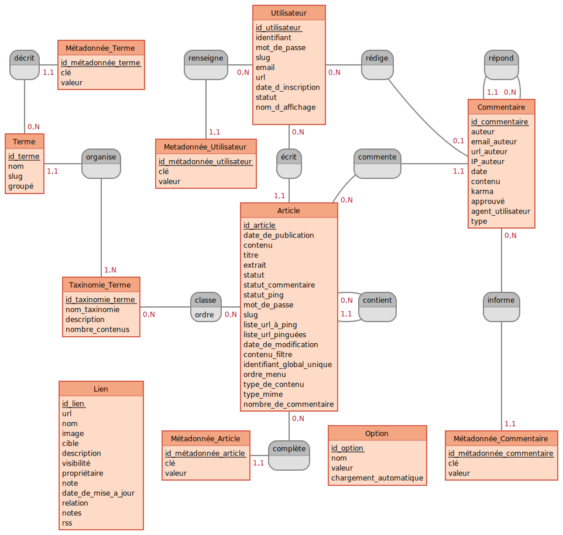

# Gestion des données avec WordPress

## Modèle conceptuel de données (MCD)

### SpotArt

### WordPress

[Voir le diagramme EER MySQL](wordpress-eer.png)

# MCD avec entités wordpress

## Entités

| Nom       | Table WordPress                   | Détail(s)           |
| --------- | --------------------------------- | ------------------- |
| Oeuvres   | `post`                            | cpt `projects`      |
| Artistes  | `users`                           | role `artists`      |
| Abonnés   | `users`                           | role `subscribers`  |
| favoris   | `subscriber_artwork_relationship` | table custom        |
| Categorie | `terms`                           | taxonomy `category` |
Catégorie: painting, scupture, drawing, photography, print
---

## Propriétés (Attributs)

### Artistes / artists

| Propriété  | Table WordPress | Colonne        | Détail(s)                 |
| ---------- | --------------- | -------------- | ------------------------- |
| idArtist   | `users`         | `ID`           |
| prénom     | `usermeta`      | `meta_value`   | `meta_key`=first_name     |
| nom        | `usermeta`      | `meta_value`   | `meta_key`=last_name      |
| pseudo     | `users`         | `display_name` |
| email      | `users`         | `user_email`   |
| biographie | `usermeta`      | `meta_value`   | `meta_key` = `biographie` |
| image      | `usermeta`      | `meta_value`   | `meta_key`=`image`        |

### Abonnés / subscribers

| Propriété    | Table WordPress | Colonne        | Détail(s)             |
| ------------ | --------------- | -------------- | --------------------- |
| idSubscriber | `users`         | `ID`           |
| prénom       | `usermeta`      | `meta_value`   | `meta_key`=first_name |
| nom          | `usermeta`      | `meta_value`   | `meta_key`=last_name  |
| pseudo       | `users`         | `display_name` |
| email        | `users`         | `user_email`   |
| image        | `usermeta`      | `meta_value`   | `meta_key`=`image`    |

### Oeuvres / Artworks

| Propriété   | Table WordPress | Colonne      | Détail(s)                |
| ----------- | --------------- | ------------ | ------------------------ |
| idArtwork   | `posts`         | `id`         |
| titre       | `posts`         | `post_title` |
| description | `posts`         | `content`    |
| dimension   | `postmeta`      | `meta_value` | `meta_key` = `dimension` |
| image1      | `postmeta`      | `meta_value` | `meta_key` = `image1`    |
| image2      | `postmeta`      | `meta_value` | `meta_key` = `image2`    |
| image3      | `postmeta`      | `meta_value` | `meta_key` = `image3`    |

### Catégories

| Propriété  | Table WordPress | Colonne   | Détail(s) |
| ---------- | --------------- | --------- | --------- |
| idCategory | `terms`         | `term_id` |
| nom        | `terms`         | `name`    |

### Favoris `subscriber_artwork_relationship`

| Propriété    | Table wordpress = table custom    | Colonne        | Détail(s) |
| ------------ | --------------------------------- | -------------- | --------- |
| idLike       | `subscriber_artwork_relationship` | `id`           |           |
| idSubscriber | `subscriber_artwork_relationship` | `idSubscriber` |           |
| idArtwork    | `subscriber_artwork_relationship` | `idArtwork`    |           |

---

# Dictionnaire de données classique

## Artiste / artists (`artist`)

| Champ      | Type         | Spécificités                                    | Description                                          |
| ---------- | ------------ | ----------------------------------------------- | ---------------------------------------------------- |
| id         | INT          | PRIMARY KEY, NOT NULL, UNSIGNED, AUTO_INCREMENT | L'identifiant de notre artiste                       |
| name       | VARCHAR(64)  | NOT NULL                                        | Le nom de l'artiste                                  |
| firstname  | VARCHAR(64)  | NOT NULL                                        | Le prénom de l'artiste                               |
| nickname   | VARCHAR(64)  | NULL                                            | Le pseudo de l'artiste                               |
| email      | VARCHAR(128) | NOT NULL                                        | L'email de l'artiste                                 |  |
| biographie | TEXT         | NULL                                            | La biographie de l'artiste                           |
| picture    | VARCHAR(128) | NULL                                            | L'URL de l'image de profil artiste                   |  |
| created_at | TIMESTAMP    | NOT NULL, DEFAULT CURRENT_TIMESTAMP             | La date de création de l'artiste                     |
| updated_at | TIMESTAMP    | NULL                                            | La date de la dernière mise à jour du profil artiste |

## Abonnés / Subscribers (`subscriber`)

| Champ      | Type         | Spécificités                                    | Description                                          |
| ---------- | ------------ | ----------------------------------------------- | ---------------------------------------------------- |
| id         | INT          | PRIMARY KEY, NOT NULL, UNSIGNED, AUTO_INCREMENT | L'identifiant de notre abonné                        |
| name       | VARCHAR(64)  | NOT NULL                                        | Le nom de l'abonné                                   |
| firstname  | VARCHAR(64)  | NOT NULL                                        | Le prénom de l'abonné                                |
| nickname   | VARCHAR(64)  | NULL                                            | Le pseudo de l'abonné                                |
| email      | VARCHAR(128) | NOT NULL                                        | L'email de l'artiste                                 |  |
| picture    | VARCHAR(128) | NULL                                            | L'URL de l'image de profil artiste                   |  |
| created_at | TIMESTAMP    | NOT NULL, DEFAULT CURRENT_TIMESTAMP             | La date de création de l'artiste                     |
| updated_at | TIMESTAMP    | NULL                                            | La date de la dernière mise à jour du profil artiste |

## Oeuvre / artwork (`artwork`)

| Champ       | Type         | Spécificités                                    | Description                                    |
| ----------- | ------------ | ----------------------------------------------- | ---------------------------------------------- |
| id          | INT          | PRIMARY KEY, NOT NULL, UNSIGNED, AUTO_INCREMENT | L'identifiant de notre oeuvre                  |
| title       | VARCHAR(64)  | NOT NULL                                        | Le titre de notre oeuvre                       |
| description | TEXT         | NULL                                            | La description de l'oeuvre                     |
| width       | INT          | NOT NULL                                        | La largeur de l'oeuvre                         |
| height      | INT          | NOT NULL                                        | La longueur de l'oeuvre                        |
| depth       | INT          | NULL                                            | La profondeur de l'oeuvre                      |
| picture     | VARCHAR(128) | NOT NULL                                        | L'URL de l'image de l'oeuvre                   |
| picture2    | VARCHAR(128) | NULL                                            | L'URL de l'image 2 de l'oeuvre                 |
| picture3    | VARCHAR(128) | NULL                                            | L'URL de l'image 3 de l'oeuvre                 |
| status      | TINYINT(1)   | NOT NULL, DEFAULT 1                             | Le statut de l'oeuvre (1=dispo, 2=pas dispo)   |
| created_at  | TIMESTAMP    | NOT NULL, DEFAULT CURRENT_TIMESTAMP             | La date de création de l'oeuvre                |
| updated_at  | TIMESTAMP    | NULL                                            | La date de la dernière mise à jour de l'oeuvre |
| category    | entity       | NOT NULL                                        | La catégorie (autre entité) de l'oeuvre        |
| artist      | entity       | NOT NULL                                        | L'artiste (autre entité) de l'oeuvre           |

## Catégories (`category`)

| Champ      | Type        | Spécificités                                    | Description                                        |
| ---------- | ----------- | ----------------------------------------------- | -------------------------------------------------- |
| id         | INT         | PRIMARY KEY, NOT NULL, UNSIGNED, AUTO_INCREMENT | L'identifiant de la catégorie                      |
| name       | VARCHAR(64) | NOT NULL                                        | Le nom de la catégorie                             |
| created_at | TIMESTAMP   | DEFAULT CURRENT_TIMESTAMP                       | La date de création de la catégorie                |
| updated_at | TIMESTAMP   | NULL                                            | La date de la dernière mise à jour de la catégorie |

## Favoris

| Champ        | Type      | Spécificités                                    | Description                          |
| ------------ | --------- | ----------------------------------------------- | ------------------------------------ |
| id           | INT       | PRIMARY KEY, NOT NULL, UNSIGNED, AUTO_INCREMENT | L'identifiant de favoris             |
| idSubscriber | INT       | NOT NULL                                        | Id de notre Abonné                   |
| idArtwork    | INT       | NOT NULL                                        | Id de l'oeuvre                       |
| created_at   | TIMESTAMP | DEFAULT CURRENT_TIMESTAMP                       | La date de création de cette liaison |
| updated_at   | TIMESTAMP | NULL                                            | La date de la dernière mise à jour   |